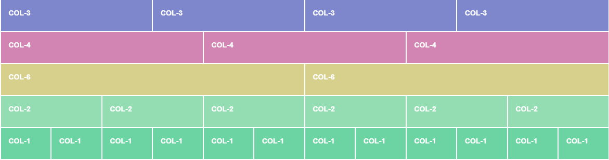

# RWD (Responsive Web Design)
* RWD is an approach to designing websites that allows them to <u>adapt to different screen sizes and devices</u>.
* RWD achieves this by using <u>flexible layouts, scalable images, and adjustable text sizes</u> to ensure that the website looks good and functions properly on all devices.

# Tools
* Media Query
* CSS Framework (e.g. Bootstrap)
  * Grid system (12)
  </img>

# Approaches
* Desktop First
  * Desktop-first approach means designing a website for desktop devices first and then adapting it for smaller screen sizes.
  * In this approach, designers start with a large screen and add features as the screen size decreases.
* Mobile First (Now mobile is widespread)
  * is a design methodology that prioritizes mobile devices when designing a website.
  *  In this approach, designers start with the smallest screen size first and then scale up.
* *Note:*
  * *Both max-width and min-width breakpoint are used in RWD regardless of desktop-first or mobile-first.*

# :books: Resources
* [Bootstrap RWD](https://getbootstrap.com/docs/5.3/layout/breakpoints/)
* [RWD for text size](https://matthewjamestaylor.com/responsive-font-size#:~:text=Responsive%20web%20design%20is%20not,16px%20(source%2C%20source).)
  * We can adopt fluid design

